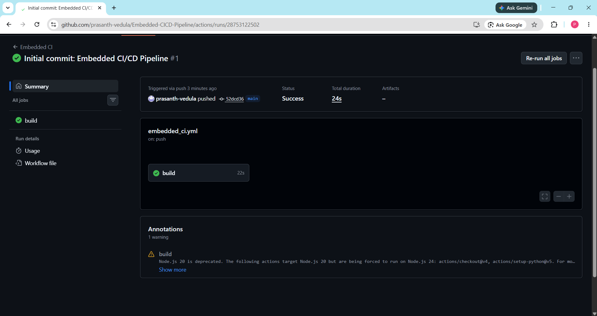
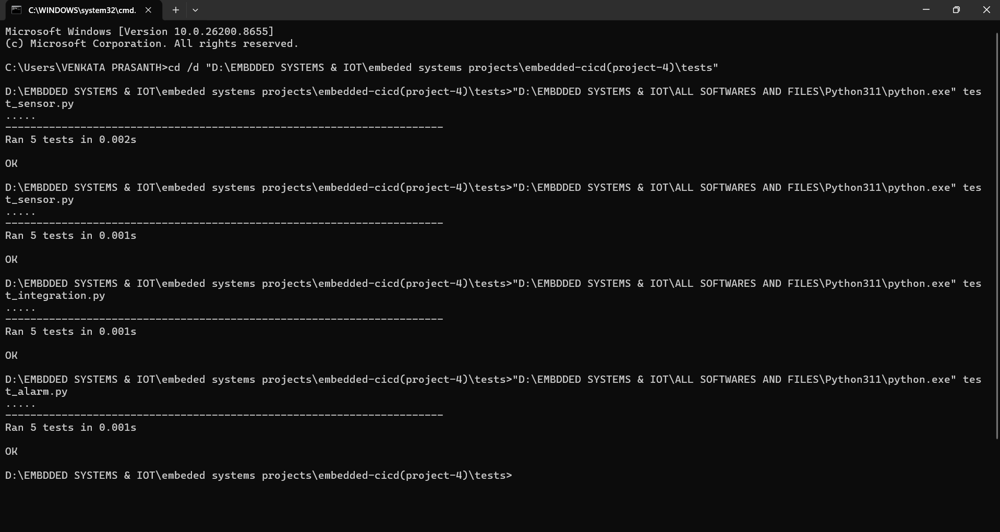
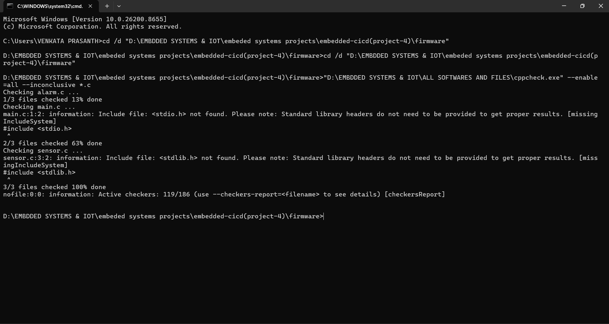
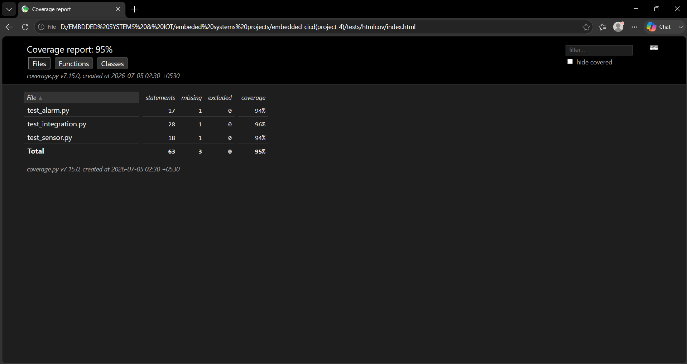
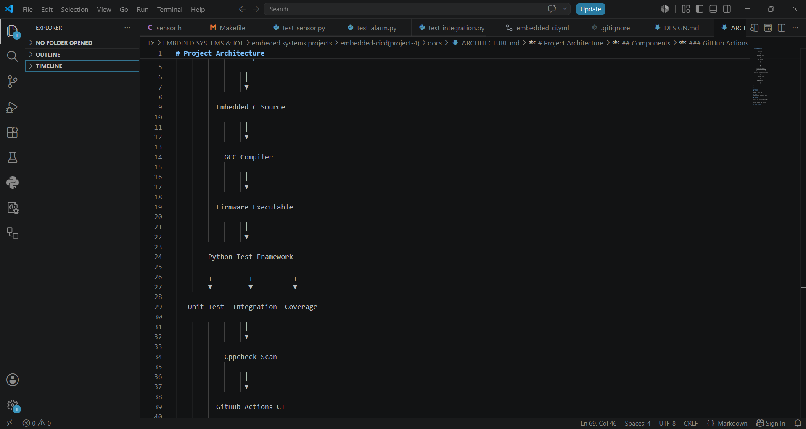

# Embedded CI/CD Pipeline

> Professional Embedded C Firmware Development Pipeline with Automated Unit Testing, Static Code Analysis, Code Coverage, and GitHub Actions Continuous Integration.

---

## Project Overview

This project demonstrates a professional Continuous Integration and Continuous Deployment (CI/CD) workflow for Embedded C firmware development.

The repository simulates the software engineering practices used in automotive, industrial automation, IoT, and embedded systems companies by integrating firmware development with automated testing, static analysis, coverage reporting, and GitHub Actions.

The objective is to ensure that every code change is automatically validated before deployment.

---

## Features

- Embedded C Firmware Development
- Modular Driver Architecture
- Automated Unit Testing
- Integration Testing
- Static Code Analysis using Cppcheck
- Code Coverage using Coverage.py
- GitHub Actions Continuous Integration
- Professional Project Structure
- Cross-platform Development Workflow
- Clean and Maintainable Codebase

---

## Project Structure

```
embedded-cicd(project-4)
│
├── .github/
│   └── workflows/
│       └── embedded_ci.yml
│
├── firmware/
│   ├── main.c
│   ├── sensor.c
│   ├── sensor.h
│   ├── alarm.c
│   ├── alarm.h
│   └── Makefile
│
├── tests/
│   ├── test_sensor.py
│   ├── test_alarm.py
│   ├── test_integration.py
│   └── htmlcov/
│
├── screenshots/
│
├── README.md
├── requirements.txt
├── LICENSE
└── .gitignore
```

---

## Technologies Used

- Embedded C
- Python
- Git
- GitHub
- GitHub Actions
- Cppcheck
- Coverage.py
- GCC
- Makefile
- Visual Studio Code

---

## CI/CD Pipeline

Every push to GitHub automatically performs:

- Source Code Compilation
- Unit Testing
- Integration Testing
- Static Code Analysis
- Code Coverage Analysis

If every stage passes successfully, the build is marked as successful.

---

## Testing

### Unit Tests

- Sensor Module
- Alarm Module

### Integration Tests

- Sensor + Alarm Communication
- Overall Firmware Validation

---

## Static Analysis

Cppcheck is used to detect:

- Memory issues
- Coding mistakes
- Dangerous programming practices
- Maintainability issues

---

## Code Coverage

Coverage.py generates an HTML report showing execution coverage for all Python test modules.

Current Coverage:

**95%**

---

## Screenshots

### GitHub Actions Success



---

### Unit Tests



---

### Cppcheck Analysis



---

### Coverage Report



---

### Project Structure



---

## Learning Outcomes

Through this project I learned:

- Professional Embedded Software Development
- Embedded Software Architecture
- Continuous Integration
- Automated Testing
- Static Code Analysis
- Code Coverage
- Git Version Control
- GitHub Actions
- Professional Repository Organization

---

## Future Improvements

- STM32 Hardware Integration
- UART Driver Testing
- SPI Driver Testing
- I2C Driver Testing
- Hardware-in-the-Loop (HIL) Testing
- Docker-based Build System
- Automatic Release Generation

---

## Author

**Vedula China Venkata Prasanth**

B.Tech Electronics and Communication Engineering

Embedded Systems | IoT | AI | Firmware Development

GitHub:
https://github.com/prasanth-vedula

---

## License

This project is released under the MIT License.